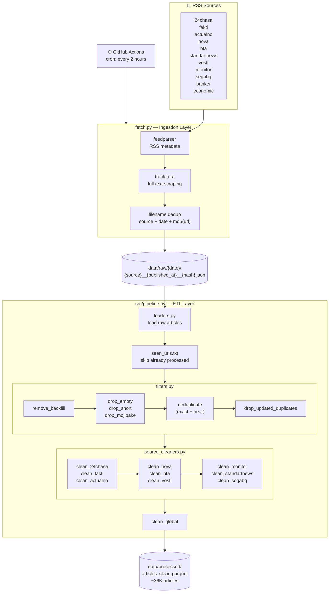

# System Architecture

```mermaid
flowchart TD
    GHA["⏱ GitHub Actions\ncron: every 2 hours"]

    subgraph FETCH["fetch.py — Ingestion Layer"]
        RSS["feedparser\nRSS metadata"]
        SCRAPE["trafilatura\nfull text scraping"]
        DEDUP_F["filename dedup\nsource + date + md5(url)"]
    end

    subgraph SOURCES["11 RSS Sources"]
        S1["24chasa\nfakti\nactualno\nnova\nbta\nstandartnews\nvesti\nmonitor\nsegabg\nbanker\neconomic"]
    end

    RAW[("data/raw/{date}/\n{source}__{published_at}__{hash}.json")]

    subgraph PIPELINE["src/pipeline.py — ETL Layer"]
        LOADER["loaders.py\nload raw articles"]
        SEEN["seen_urls.txt\nskip already processed"]
        
        subgraph FILTERS["filters.py"]
            F1["remove_backfill"]
            F2["drop_empty\ndrop_short\ndrop_mojibake"]
            F3["deduplicate\n(exact + near)"]
            F4["drop_updated_duplicates"]
        end

        subgraph CLEANERS["source_cleaners.py"]
            C1["clean_24chasa\nclean_fakti\nclean_actualno"]
            C2["clean_nova\nclean_bta\nclean_vesti"]
            C3["clean_monitor\nclean_standartnews\nclean_segabg"]
        end

        C4["clean_global"]
    end

    OUT[("data/processed/\narticles_clean.parquet\n~36K articles")]

    GHA --> FETCH
    SOURCES --> RSS
    RSS --> SCRAPE
    SCRAPE --> DEDUP_F
    DEDUP_F --> RAW
    RAW --> LOADER
    LOADER --> SEEN
    SEEN --> FILTERS
    F1 --> F2 --> F3 --> F4
    FILTERS --> CLEANERS
    C1 --> C2 --> C3
    CLEANERS --> C4
    C4 --> OUT
```
