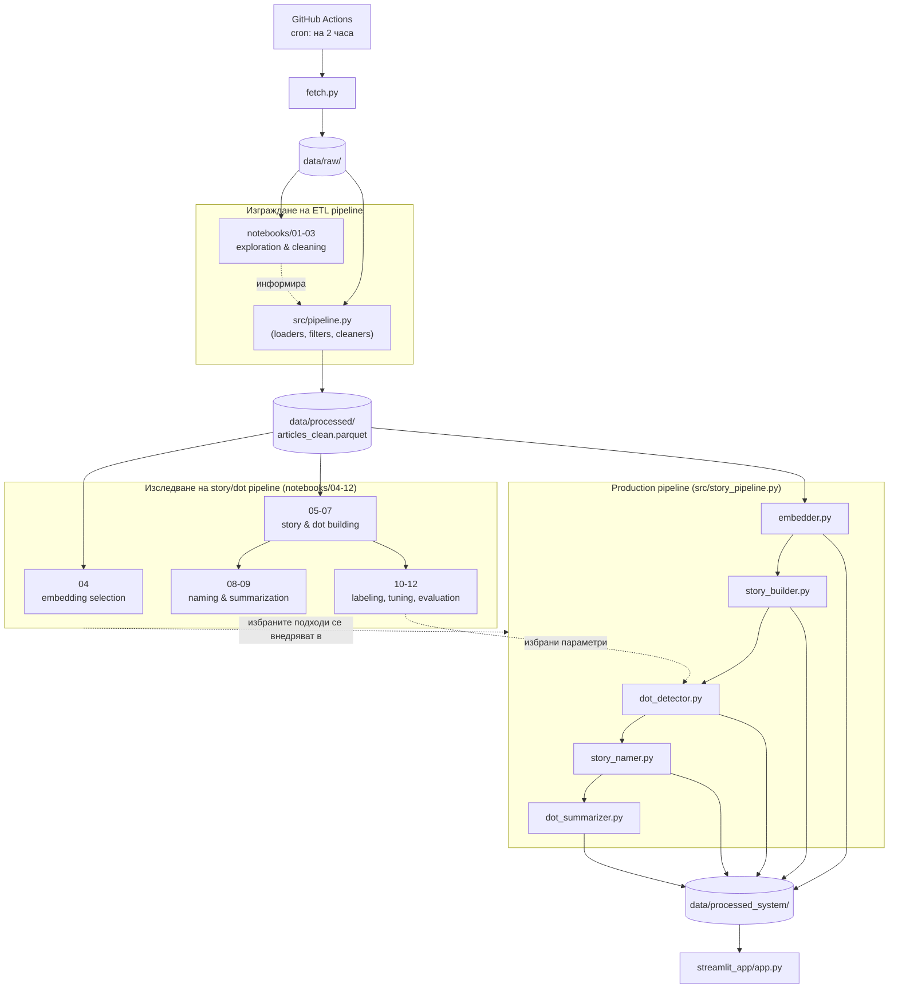

## Repository Structure

```
msc_thesis/
├── fetch.py                    # RSS ingestion - входна точка
├── check_rss.py                # откриване на нови RSS адреси
├── requirements.txt
│
├── .github/workflows/
│   └── fetch_rss.yml           # cron - изпълнява fetch.py на всеки 2 часа
│
├── src/                         # production ETL + ML pipeline
│   ├── pipeline.py              # ETL оркестратор → articles_clean.parquet
│   ├── loaders.py                #   зареждане на суровите JSON файлове
│   ├── filters.py                 #   премахване на дубликати/нерелевантни
│   ├── cleaners.py                 #   общи функции за почистване на текст
│   ├── source_cleaners.py           #   почистване по източник
│   │
│   ├── embedder.py               # BGE-M3 ембединги
│   ├── story_builder.py          # изграждане на истории
│   ├── dot_detector.py           # детекция на моменти от развитие
│   ├── story_namer.py            # именуване на истории по ден
│   ├── dot_summarizer.py         # обобщаване с BgGPT през Ollama
│   └── story_pipeline.py         # оркестрира embedder → ... → dot_summarizer
│
├── notebooks/                    # 01-12, изследване и разработка
│   ├── 01_data_exploration.ipynb
│   ├── 02_data_cleaning.ipynb
│   ├── 03_cleaning_with_llm.ipynb
│   ├── 04_embedding_selection.ipynb
│   ├── 05_story_building_traditional.ipynb
│   ├── 06_story_building_modern.ipynb
│   ├── 07_dots_building.ipynb
│   ├── 08_story_naming.ipynb
│   ├── 09_dot_summaries.ipynb
│   ├── 10_evaluation_labeling.ipynb
│   ├── 11_parameter_tuning.ipynb
│   └── 12_evaluation.ipynb
│
├── streamlit_app/
│   └── app.py                    # интерактивен интерфейс
│
└── data/
    ├── raw/{дата}/{източник}__{публикувано}__{hash}.json
    │
    ├── processed/                 # изходи от изследователските тетрадки
    │   ├── articles_clean.parquet
    │   ├── embeddings.npy, stories.pkl
    │   └── dots_louvain*.pkl, story_names*.pkl, keywords.pkl
    │
    ├── processed_system/           # изход на production pipeline (ползва се от UI)
    │   ├── embeddings.npy, stories.pkl
    │   └── dots_louvain.pkl, story_names.pkl, dot_summaries.pkl
    │
    ├── evaluation/                  # ръчно етикетирани данни
    │   ├── sample_<bucket>.parquet
    │   └── ground_truth_<bucket>.json
    │
    ├── experiments/                 # експерименти с ембединги/почистване
    └── keywords/                    # междинни резултати - подход с ключови думи
```

---

## Комуникация между компонентите



Диаграмата следва реалния ред на разработка:

1. **Изграждане на ETL pipeline** — суровите данни (`data/raw/`) се изследват в notebooks 01-03, които информират решенията при писането на `src/pipeline.py`; крайният резултат е `data/processed/articles_clean.parquet`.
2. **Изследване на story/dot pipeline** (notebooks 04-12) — върху почистения корпус се избира модел за ембединги, тества се изграждане на истории/моменти от развитие, и се прави ръчно етикетиране и настройка на параметри; избраните параметри (напр. `min_similarity`/`max_gap_cap_hours`) се прехвърлят като настройки по подразбиране в `src/dot_detector.py`.
3. **Production pipeline** (`src/story_pipeline.py`) — изпълнява същите стъпки върху целия корпус и записва резултата в `data/processed_system/`, който се визуализира от `streamlit_app/app.py`.
