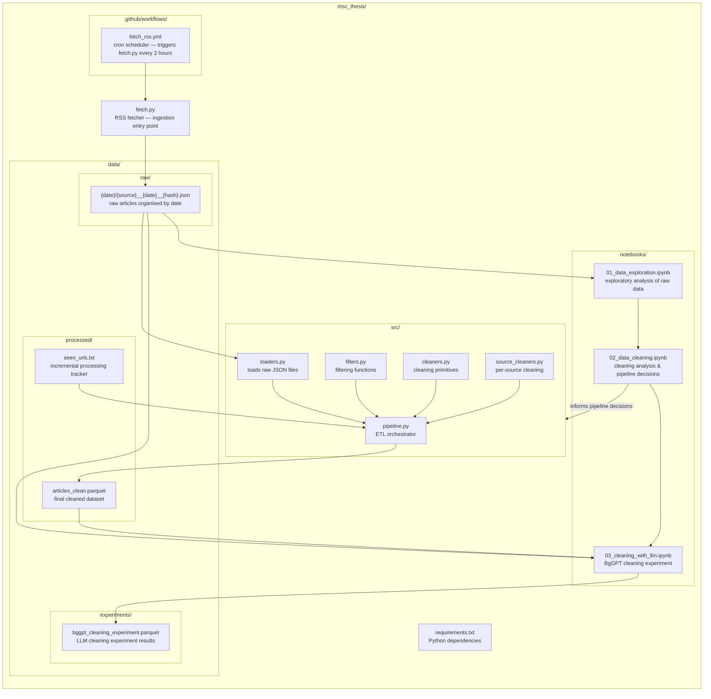

## Repository Structure

```
msc_thesis/
├── fetch.py                          # RSS fetcher — ingestion entry point
├── check_rss.py                      # utility — discovers RSS feed URLs for new sources
├── requirements.txt                  # Python dependencies
│
├── .github/
│   └── workflows/
│       └── fetch_rss.yml             # cron scheduler — triggers fetch.py every 2 hours
│
├── notebooks/
│   ├── 01_data_exploration.ipynb     # exploratory analysis of raw data
│   ├── 02_data_cleaning.ipynb        # cleaning analysis & pipeline decisions
│   └── 03_cleaning_with_llm.ipynb    # experiment: BgGPT-based cleaning vs rule-based pipeline
│
├── src/
│   ├── pipeline.py                   # ETL orchestrator
│   ├── loaders.py                    # loads raw JSON files
│   ├── filters.py                    # filtering functions
│   ├── cleaners.py                   # cleaning primitives
│   └── source_cleaners.py            # per-source cleaning
│
└── data/
    ├── raw/
    │   └── {date}/
    │       └── {source}__{date}__{hash}.json   # raw articles organised by date
    ├── processed/
    │   ├── articles_clean.parquet    # final cleaned dataset
    │   └── seen_urls.txt             # incremental processing tracker
    └── experiments/
        └── bggpt_cleaning_experiment.parquet  # LLM cleaning experiment results (300 articles)
```

---

## Component Interactions


