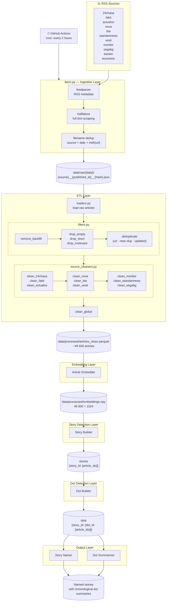

# System Architecture — Full Pipeline

```mermaid
flowchart TD
    GHA["⏱ GitHub Actions\ncron: every 2 hours"]

    subgraph FETCH["fetch.py — Ingestion Layer"]
        RSS["feedparser\nRSS metadata"]
        SCRAPE["trafilatura\nfull text scraping"]
        DEDUP_F["filename dedup\nsource + date + md5(url)"]
    end

    subgraph SOURCES["11 RSS Sources"]
        S1["24chasa\nfakti\nactualno\nnova\nbta\nstandartnews\nvesti\nmonitor\nsegabg\nbanker\neconomic"]
    end

    RAW[("data/raw/{date}/\n{source}__{published_at}__{hash}.json")]

    subgraph PIPELINE["ETL Layer"]
        LOADER["loaders.py\nload raw articles"]

        subgraph FILTERS["filters.py"]
            F1["remove_backfill"]
            F2["drop_empty\ndrop_short\ndrop_irrelevant"]
            F3["deduplicate\n(url · near-dup · updated)"]
        end

        subgraph CLEANERS["source_cleaners.py"]
            C1["clean_24chasa\nclean_fakti\nclean_actualno"]
            C2["clean_nova\nclean_bta\nclean_vesti"]
            C3["clean_monitor\nclean_standartnews\nclean_segabg"]
        end

        C4["clean_global"]
    end

    CORPUS[("data/processed/articles_clean.parquet\n~49 600 articles")]

    subgraph EMBEDDING["Embedding Layer"]
        EMB["Article Embedder"]
    end

    VECTORS[("data/processed/embeddings.npy\n49 600 × 1024")]

    subgraph STORY_LAYER["Story Detection Layer"]
        STORY["Story Builder"]
    end

    STORIES[("stories\n{story_id: [article_ids]}")]

    subgraph DOT_LAYER["Dot Detection Layer"]
        DOT["Dot Builder"]
    end

    DOTS[("dots\n{story_id: {dot_id: [article_ids]}}")]

    subgraph OUTPUT_LAYER["Output Layer"]
        NAMER["Story Namer"]
        SUMM["Dot Summarizer"]
    end

    RESULT[("Named stories\nwith chronological dot summaries")]

    GHA --> FETCH
    SOURCES --> RSS
    RSS --> SCRAPE --> DEDUP_F
    DEDUP_F --> RAW
    RAW --> LOADER
    LOADER --> FILTERS
    F1 --> F2 --> F3
    FILTERS --> CLEANERS
    C1 --> C2 --> C3
    CLEANERS --> C4
    C4 --> CORPUS
    CORPUS --> EMB
    EMB --> VECTORS
    VECTORS --> STORY
    STORY --> STORIES
    STORIES --> DOT
    DOT --> DOTS
    DOTS --> NAMER
    DOTS --> SUMM
    NAMER --> RESULT
    SUMM --> RESULT
```
